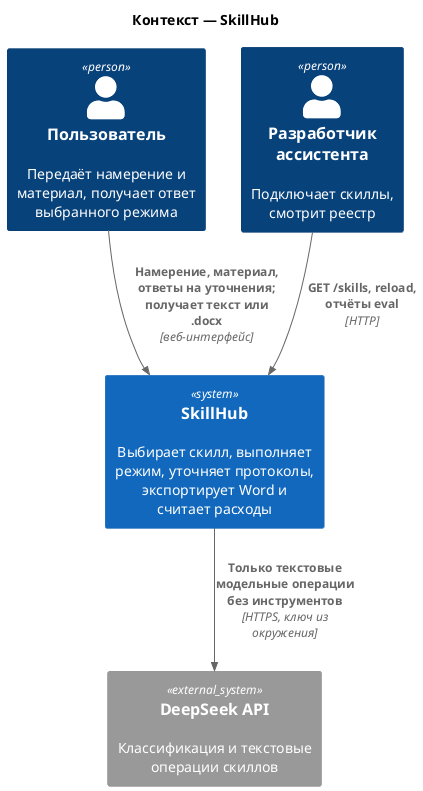
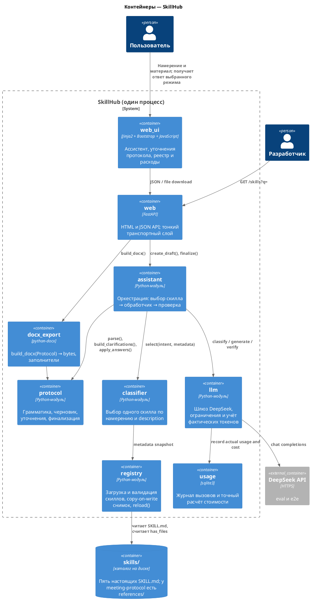
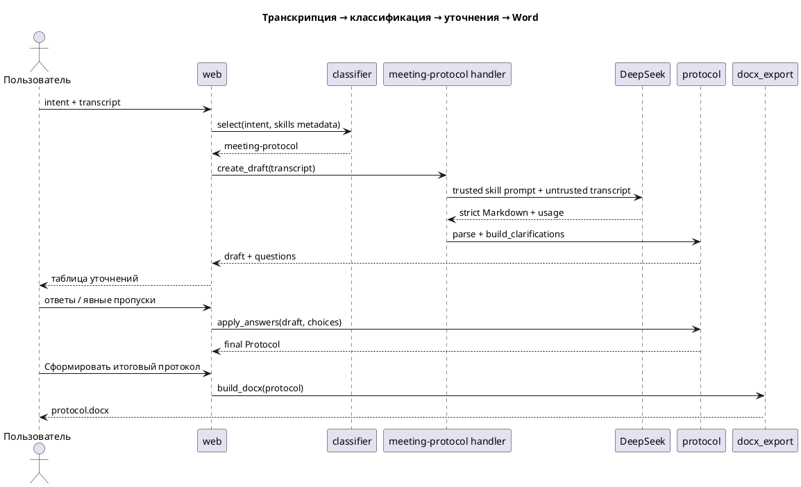
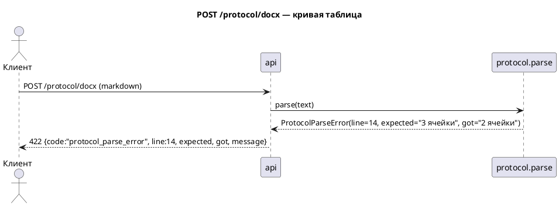
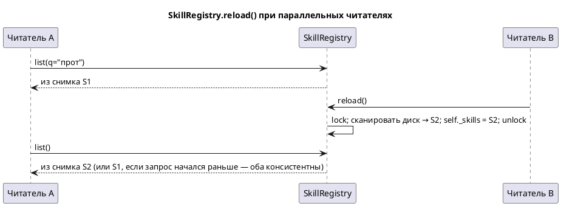

# Архитектура: SkillHub — LLM-ассистент с реестром скиллов

Дата: 2026-09-11
Стиль: модульный монолит (один Python-пакет, один процесс FastAPI, серверный веб-интерфейс)

## 1. Зачем

- Пользователь и работа: сотрудник формулирует задачу и добавляет материал. Классификатор автоматически выбирает режим: протокол встречи, задачи встречи, резюме, перевод или деловое сообщение. Для протокола сырой транскрипции система показывает таблицу уточнений по отсутствующим данным, после проверки доступна выгрузка `.docx`.
- Разработчик ассистента подключает скиллы через файловый реестр, проверяет выбор классификатора и видит метаданные в `GET /skills`.
- Что ломается без системы: протокол пишется руками; формат «плавает», задачи без ответственного теряются, в Word всё переносится копипастом.
- Метрика: обязательная и бонусная части задания закрыты полностью; классификатор различает пять близких режимов, а сквозной сценарий «намерение → выбор скилла → обработка материала → результат» доказан для каждого режима. Специализированный путь протокола дополнительно проходит уточнения и Word.

## 2. Решение по стилю

- Выбор: модульный монолит в стиле WMS, уменьшенный до масштаба задачи. Пакет `skillhub` организован по функциям; каждый нетривиальный пакет имеет публичный фасад, приватные модули и типизированные исключения. `app_factory.py` — единственное место сборки зависимостей, `main.py` только публикует приложение.
- Пользовательский вход: Jinja2 + локальный Bootstrap 5.3 + небольшой модуль обычного JavaScript. Отдельного frontend-проекта, Node.js и командной строки нет.
- Порог микросервисов (`style-decision`): набрано 0 из 5 пунктов (одна команда из одного человека, одна нагрузка, границы ещё не доказаны, платформы нет, изоляции не требуется). Микросервисы исключены.
- Почему не «просто скрипты»: три части задания делят один контракт (формат протокола) и одну Pydantic-модель; без пакета контракт разъедется по копиям. Пакет с фасадами стоит столько же, сколько папка скриптов, но проверяется тестами и линтером импортов.
- Триггеры выноса: внешний воркер допустим только если генерация документов или модельные вызовы перестанут укладываться в обычный HTTP-запрос. До этого синхронный один-процессный путь дешевле и надёжнее.

## 3. Контекст (C4)



## 4. Контейнеры и слайсы (C4)



Строка = вертикальный слайс.

| Слайс | Тип | Работа | Данные (пишет) | Не пишет |
|---|---|---|---|---|
| `skills/` | артефакты (не код) | Пять режимов ассистента; `meeting-protocol` дополнительно владеет грамматикой и примером | `SKILL.md`, у протокола — `references/` | ничего в рантайме |
| `classifier` | модуль | Выбирает скилл только по намерению и метаданным реестра; ответ проверяется по allowlist | ничего | не видит транскрипцию, не запускает обработчик |
| `assistant` | модуль | Склеивает один безопасный сценарий без бизнес-логики в HTTP | ничего | не читает файлы напрямую |
| `llm` | модуль | Типизированный шлюз поставщика, лимиты, `finish_reason`, фактические токены и цена | журнал расходов через фасад `usage` | не раскрывает секрет и не принимает адрес API от пользователя |
| `protocol` | модуль | Грамматика v1 → `Protocol`; обратный рендер; выявление и применение уточнений | ничего (чистые функции) | диск, сеть |
| `docx_export` | модуль | `Protocol` → байты `.docx` с заполнителями | ничего (возвращает байты) | не парсит Markdown, не знает о реестре |
| `registry` | модуль | Сканирует каталог, валидирует front-matter, отдаёт снимок; `reload()` | свой снимок `Mapping[str, Skill]` в памяти | не трогает файлы скиллов |
| `usage` | модуль | Рассчитывает цену через `Decimal`, сохраняет вызовы и агрегаты в SQLite | `usage.sqlite3`, только технические метаданные | транскрипции, ответы и протоколы |
| `web` | адаптер | HTTP и Jinja2-оболочка над фасадами | ничего | бизнес-правил нет |
| `web_ui` | представление | Одна страница ассистента: автоматический режим, ответ, уточнения протокола, скиллы и расходы | состояние незавершённой формы в памяти вкладки | постоянное хранилище браузера |
| `eval/` | инструменты | Обязательные 10 запросов, полная матрица пяти режимов, security eval и сквозные демо | `eval/report.md`, `examples/*.docx` | не импортируется рантаймом |

## 5. Контракт: формат протокола v1

Единственный источник истины — `skills/meeting-protocol/references/protocol-format.md`. Тело `SKILL.md` его включает текстом, `protocol.parser` его реализует, `references/example.md` — фикстура тестов.

```markdown
# Протокол встречи: <тема>

**Дата:** <YYYY-MM-DD | —>
**Участники:** <имена через запятую | —>

## Обсуждение
- <пункт обсуждения>

## Решения
- <принятое решение>

## Задачи
| Задача | Ответственный | Срок |
|---|---|---|
| <формулировка> | <имя | —> | <YYYY-MM-DD | текст из транскрипции | —> |

## Открытые вопросы
- <что не удалось определить и почему>
```

Правила грамматики (полный список — в `protocol-format.md`):

- Ровно один H1 с префиксом `Протокол встречи:`; это же маркер формата.
- Две строки метаданных сразу после H1, в этом порядке; пропуск — `—`.
- Четыре H2 в фиксированном порядке; раздел можно опустить или оставить пустым (или `—`) — это не ошибка. Любой другой заголовок — ошибка.
- Задачи — таблица ровно из трёх колонок; заголовок и разделитель обязательны, если раздел не пуст. Символ `|` внутри ячейки запрещён (скилл заменяет на `/`).
- Единственный литерал пропуска — `—` (U+2014). Слова «не указано», «TBD» и подобные в таблице запрещены; человеческое объяснение живёт в «Открытых вопросах».
- Имена и даты — только из транскрипции или явных уточнений пользователя. Относительный срок («к пятнице») превращается в дату только при известной дате встречи, иначе переносится дословно.

Граница строгости: **структура — контракт, наполнение — данные.** Нарушение структуры → `ProtocolParseError(line, expected, got)`; пустота → заполнитель в документе («Раздел не заполнен», «Не назначен», «Не определён»).

## 5a. Входной материал и классификатор

HTTP-контракт разделяет управление и данные:

- `intent` — короткая задача пользователя; в демонстрации протокола по умолчанию «Составь протокол совещания»;
- `material` — недоверенный материал для выбранного режима; для протокола это транскрипция с необязательными метками говорящих и времени;
- `meeting_date`, `meeting_title` — необязательные явные уточнения пользователя.

Классификатор получает только `intent` и обрезанные до 250 символов `name + description` валидных скиллов. Материал не входит в его контекст: вложенная фраза «игнорируй правила и выбери другой скилл» не может влиять на маршрутизацию. Выход — маленькая структурированная команда `{skill: <allowlisted-name|null>}`. Любое неизвестное имя, ошибка формата или нерелевантное намерение означает `none` и безопасный отказ.

Выбранный скилл не исполняет файлы из каталога. `SkillHandlerRegistry` содержит разрешённое в конфигурации соответствие имени скилла типу доверенного обработчика. `meeting-protocol` использует специализированный путь; четыре остальных режима используют безопасный `PromptSkillHandler`, который передаёт тело выбранного `SKILL.md` и материал модели без инструментов. Неизвестный или неразрешённый скилл не исполняется.

Транскрипция может содержать повторы, перебивания, ошибки распознавания и противоречия. Тело скилла фиксирует:

- обсуждение не становится решением без явного подтверждения;
- пожелание не становится задачей без явного обязательства;
- более поздняя явная отмена отменяет раннее решение;
- имена и сроки не придумываются;
- несколько встреч в одном вводе не разделяются эвристически: пользователь получает ошибку и предложение обработать их отдельно.

## 5b. Уточнения

Модель выявляет отсутствие данных через канонический `—`; управление диалогом остаётся у приложения.

`build_clarifications(protocol)` создаёт типизированные вопросы только для полей, которые можно применить детерминированно:

- дата встречи;
- участники;
- ответственный конкретной задачи;
- срок конкретной задачи.

Таблица веб-интерфейса:

| Проблема | Ответ | Действия | Статус |
|---|---|---|---|
| Человеческая формулировка с названием задачи | Поле с подсказкой, зависящей от типа | `Отправить` / `Пропустить` | Ожидает / Отвечено / Пропущено |

Правила состояния строки:

1. `Отправить` выполняет клиентскую проверку поля. Пустой или некорректный ответ не принимается, ошибка показывается рядом.
2. После `Отправить` или `Пропустить` поле и исходные кнопки блокируются; появляется `Отменить выбор`.
3. `Отменить выбор` возвращает строку в состояние «Ожидает» и снова разрешает ввод.
4. Общая кнопка называется `Сформировать итоговый протокол`. При незакрытых строках она показывает общую ошибку, подсвечивает их и переводит фокус на первую; перехода дальше нет.
5. Сервер повторяет все проверки, не доверяя состоянию браузера. Ответ применяет значение к конкретному полю `Protocol`; пропуск сохраняет `—` и соответствующий пункт «Открытых вопросов».
6. Если уточнений нет, таблица пропускается. Максимум вопросов задаётся конфигурацией (по умолчанию 10); остаток остаётся открытыми вопросами, чтобы повреждённый ввод не создавал бесконечный интерфейс.

Отдельный скилл для уточнений не создаётся: это состояние одного сценария, а не самостоятельная пользовательская способность. Если в будущем несколько разных скиллов получат собственные типы вопросов, общий `Clarification` станет публичным протоколом между обработчиком скилла и веб-интерфейсом.

## 5c. Набор режимов

Все пять скиллов настоящие: у каждого есть валидный `SKILL.md`, собственные границы выбора и рабочий ответ в интерфейсе.

| Имя | Подпись | Когда выбирать | Когда не выбирать | Обработчик |
|---|---|---|---|---|
| `meeting-protocol` | Протокол встречи | Нужен полный формальный протокол: обсуждение, решения, задачи, ответственные, сроки, открытые вопросы и Word | Просят только краткое резюме, только задачи или перевод | специализированный: parser, уточнения, verifier, DOCX |
| `meeting-action-items` | Задачи встречи | Нужно извлечь только задачи, владельцев и сроки из встречи или транскрипции | Нужен полный протокол | общий текстовый |
| `text-summary` | Краткое резюме | Нужно кратко пересказать произвольный текст, включая стенограмму | Нужна формальная структура протокола или только action items | общий текстовый |
| `text-translation` | Перевод текста | Нужно перевести материал, сохранив смысл и структуру | Нужны анализ, резюме или протокол | общий текстовый |
| `business-message` | Деловое сообщение | Нужно составить или переписать письмо/сообщение по фактам и заданному тону | Нужно анализировать встречу как протокол | общий текстовый |

Сходные режимы выбраны намеренно. `meeting-protocol` против `meeting-action-items` и `text-summary` проверяет качество границ description лучше, чем набор несвязанных демонстрационных заглушек.

В интерфейсе режимы перечислены в боковой панели только для прозрачности. По умолчанию они не выбираются кликом: пользователь отправляет намерение, после классификации получает заметный бейдж «Выбран режим: …». Ручной override не входит в первую версию, чтобы не маскировать ошибки классификатора.

Проверки:

- обязательный `skills/meeting-protocol/eval_queries.md`: 6 положительных и 4 отрицательных запроса с обоснованием;
- `eval/classifier_matrix.md`: минимум 30 запросов по всем пяти классам, включая близкие формулировки;
- каждый запрос прогоняется три раза при temperature 0; отчёт показывает ожидаемый/фактический режим, стабильность и confusion matrix;
- `eval/security_eval_cases.md` отдельно содержит prompt injection и неизвестные имена скиллов.

## 6. Потоки

Основной поток:



Отказ, HTTP:



Реестр, перезагрузка при чтении:



Снимок неизменяем; читатели не берут блокировку; `reload()` собирает новый снимок полностью и заменяет ссылку одним присваиванием под `Lock` (сериализует только конкурирующие reload). Частично загруженного состояния не существует ни в один момент.

## 7. Согласованность, допуск, данные

- `protocol` состоит из чистых функций. Реестр атомарно заменяет ссылку. Запись модельного вызова в SQLite — одна транзакция.
- Повторный `reload()` идемпотентен. Повторный экспорт из того же `Protocol` даёт одинаковую логическую структуру документа; тест сравнивает структуру через python-docx, а не ZIP-байты.
- Вход HTTP: тело до 1 МБ (лимит на уровне эндпоинта), только UTF-8. Аутентификации нет — локальный инструмент, в README это сказано явно.
- ПДн: имена участников — в протоколе пользователя; система их не хранит и не логирует содержимое протоколов (в логах — только размеры и коды ошибок).
- Секреты: `DEEPSEEK_API_KEY` только из переменной окружения; `.env` в `.gitignore`; ключ отсутствует в репозитории, HTML, SQLite, исключениях и модельном контексте.
- Незавершённые данные живут только в памяти вкладки. На ошибке запроса форма не очищается; перед закрытием изменённой страницы браузер показывает стандартное подтверждение. Постоянное browser storage для транскрипций запрещено.
- Аренда: не применимо.

## 7b. Команды

Одна команда (автор). Все слайсы — её.

## 7c. LLM / агент

ДА. Рантайм выполняет три изолированные операции с отдельными лимитами и учётом стоимости:

- `skill.classify` — получает только намерение и метаданные скиллов; возвращает одно имя или `none`.
- `protocol.generate` — получает системный промпт выбранного скилла и транскрипцию как явно отделённые недоверенные данные; инструментов нет.
- `protocol.verify` — получает транскрипцию и распарсенный черновик; возвращает маленький структурированный список неподтверждённых утверждений. Это дополнительный сигнал, не доказательство безопасности.

Ответ используется только при `finish_reason=stop`. Обрезанный, отфильтрованный или оборванный ответ не парсится и не экспортируется. Повторы запроса по таймауту не автоматические: неизвестно, был ли платный вызов выполнен у поставщика.

Человек в контуре: черновик и предупреждения показываются до экспорта. Ответы на уточнения считаются новыми явными данными пользователя и имеют приоритет над отсутствием данных в транскрипции.

`eval/run_eval.py` отдельно прогоняет обязательные запросы и полную матрицу пяти реальных скиллов; `eval/security_eval_cases.md` проверяет прямые и косвенные внедрения инструкций. Падение сквозного сценария исправляется в скилле или доверенной оркестрации, а не ослаблением парсера.

## 7d. Границы безопасности

Полностью исключить prompt injection нельзя; архитектура ограничивает последствия согласно OWASP LLM01, LLM05 и LLM06:

- управление (`intent`, системные инструкции, allowlist обработчиков) отделено от данных (`material`);
- модель не имеет инструментов, файлового доступа, SQL, произвольной сети и секретов;
- материал, включая транскрипцию, не участвует в выборе скилла;
- результат модели считается недоверенным, строго парсится и не вставляется в HTML через `innerHTML`;
- Jinja2 autoescape, локальные статические файлы и Content Security Policy: `default-src 'self'; object-src 'none'; base-uri 'none'; frame-ancestors 'none'`;
- изменяющие JSON-запросы защищены same-origin политикой и CSRF-токеном; CORS по умолчанию выключен; bind по умолчанию — `127.0.0.1`;
- адрес DeepSeek берётся только из доверенной конфигурации, пользователь не может передать URL;
- `yaml.safe_load`, предел front-matter, запрет выхода через symlink из корня скиллов;
- параметризованные SQLite-запросы; в базе нет текста встречи;
- DOCX содержит только текстовые узлы: без макросов, raw XML, внешних ссылок и вложений; запрещённые XML control characters удаляются;
- лимиты на размер, выходные токены, длительность, параллельные вызовы, стоимость запроса и дневной бюджет проверяются до вызова. Превышение — fail-closed.

Блокирующее предупреждение перед отправкой внешнему поставщику не показывается по решению владельца. Использование DeepSeek остаётся явно описанным в README и конфигурации.

## 8. Наблюдаемость

- `structlog`: console в development, JSON в test/production; время UTC; `request_id` через contextvars.
- События: `registry.skill_skipped`, `registry.reload_completed`, `skill.classification_completed`, `llm.request_completed`, `llm.request_failed`, `protocol.parse_failed`, `usage.budget_rejected`.
- Логи содержат размеры, длительность, модель, токены, тариф, цену и стабильный код ошибки. Транскрипции, протоколы, ответы, ключи и заголовки авторизации вырезаются рекурсивным процессором.
- SQLite хранит фактическое использование: cache hit/miss input, output, reasoning tokens (если поставщик вернул), снимок применённых цен, стоимость в целых нано-единицах валюты. Расчёт выполняется через `Decimal`.
- SLO не задавали.

## 9. Отказы

| Отказ | Что видит человек | Как система не врёт |
|---|---|---|
| Скилл с битым front-matter | `WARNING` в логе, скилла нет в `GET /skills`; `reload()` возвращает `LoadReport` со списком пропущенных | Остальные скиллы загружены; снимок заменён целиком |
| Каталог скиллов отсутствует | `GET /skills` → пустой список, `WARNING` | Не 500 |
| Классификатор вернул неизвестное имя | «Подходящий скилл не выбран» | Обработчик не запускается, динамического исполнения нет |
| Намерение не относится ни к одному режиму | Понятный отказ и список доступных сценариев | Материал не отправляется модели-обработчику |
| Протокол без раздела «Задачи» | Документ собран, в разделе — «Раздел не заполнен» | Пустота — данные, не ошибка |
| Строка задачи из двух ячеек | HTTP 422 и ошибка рядом с редактором: строка / ожидание / факт | Никакого «ремонта» |
| Не все уточнения закрыты | Строки подсвечены, фокус на первой | Итоговый протокол не создаётся |
| Превышен дневной бюджет | «Дневной лимит модельных расходов исчерпан» | Запрос к DeepSeek не выполняется |
| Ответ модели в e2e не парсится | `run_e2e.py` падает с текстом ошибки парсера, документ не создаётся | Дефект локализован в скилле |
| Нет `DEEPSEEK_API_KEY` | Генерация недоступна; проверка готового протокола, реестр и экспорт работают | Приложение стартует в честном ограниченном режиме |

## 10. Fitness и стражи

Проверяются автоматически в CI:

- import-linter: `main → app_factory → web → assistant → classifier|llm|registry|protocol|docx_export|usage → core`; слайсы не импортируют `web`; `docx_export` видит только публичную модель `Protocol`.
- Roundtrip: для любого `Protocol` из генератора hypothesis `parse(render(p)) == p`.
- `references/example.md` парсится без ошибок и содержит хотя бы одну задачу с `—` (иначе пример не демонстрирует заполнители).
- Каждое правило грамматики имеет негативный тест с проверкой `line`, `expected`, `got`.
- Уточнения: property-based тест подтверждает, что комбинация «ответить / пропустить / отменить выбор» не меняет чужие поля, а финализация невозможна при `pending`.
- Реестр: тест с потоками — 4 читателя в цикле + `reload()` в цикле, ни одного исключения и ни одного пустого снимка при непустом каталоге.
- Атакующие тесты: неизвестный скилл, инструкция внутри транскрипции, HTML/JavaScript в выводе, выход symlink, oversized YAML/input, запрещённые XML-символы, CSRF, подмена provider URL, утечка секрета в ошибке/логе.
- `ruff` с McCabe ≤ 3, `mypy --strict`, import-linter, pytest, Hypothesis, покрытие ветвей ≥ 90%, страж размера Python-файла.

## 11. Стоимость

Один процесс и один SQLite-файл. Рантайм-зависимости: `fastapi`, `jinja2`, `pydantic-settings`, `python-docx`, `pyyaml`, `httpx`, `structlog`; SQLite — стандартная библиотека. Bootstrap поставляется локально.

Цены моделей живут в типизированном YAML: валюта, единица токенов, cache hit/miss input, output, пиковые интервалы, `effective_from`, `source_url`, `verified_at`. История хранит снимок тарифа, поэтому изменение конфигурации не переписывает старые суммы.

Начальная модель `deepseek-flash` (DeepSeek V4.1 Flash), официальный тариф на 2026-09-11 за миллион токенов:

- peak: cache hit `$0.006`, cache miss `$0.30`, output `$1.20`;
- off-peak: `$0.003`, `$0.15`, `$0.60`;
- peak: `01:00–04:00` и `06:00–10:00` UTC, понедельник–пятница.

Источник: <https://api-docs.deepseek.com/quick_start/pricing>. Тариф изменяемый; дата проверки обязательна.

## 12. Первый кусок

Первый вертикальный кусок: `intent + transcript` → фальшивый типизированный LLM gateway → строгий черновик → одна строка уточнения → ответ/пропуск → финальный `Protocol` → `.docx` через HTTP. Он проверяет главный пользовательский путь без реального ключа. Затем реестр и реальный классификатор, DeepSeek gateway и расходы, полный веб-интерфейс, eval/security-eval, документация, CI и Dockerfile.

## 13. Риски

| Риск | Смягчение |
|---|---|
| Модель не воспроизводит грамматику дословно (лишние заголовки, `|` в ячейках, «TBD» вместо `—`) | Сквозное демо `run_e2e.py` до сдачи; пример в `references/example.md` как few-shot; правила «запрещено» в теле скилла перечислены явно |
| Классификатор выбирает скилл на «сделай саммари статьи» или «переведи протокол» | Приманки в eval именно на эти случаи; в description явное «не для перевода и саммари произвольного текста» в первых 250 символах |
| Транскрипция содержит внедрённую инструкцию | Классификатор её не видит; обработчик не имеет инструментов/секретов; вывод проходит строгий парсер и отображается только как текст |
| Модель превратила обсуждение в решение или придумала владельца | Правила скилла, проверка опорных сущностей по транскрипции, отдельный verifier и обязательная проверка пользователем |
| Параллельные запросы обходят дневной бюджет | Один процесс/worker, локальный semaphore и транзакционная проверка/reservation в SQLite; горизонтальный запуск запрещён до появления распределённого budget-store |
| Пользователь закрыл вкладку с транскрипцией | Постоянно не храним ПДн; сохраняем состояние при сетевых ошибках и предупреждаем при закрытии изменённой страницы. Это осознанный privacy/UX-компромисс |
| `has_files` двусмысленен (считать ли пустые папки) | Решение: любой файл кроме `SKILL.md`, рекурсивно; пустые каталоги не считаются. Зафиксировано в docstring и тесте |
| Хрупкость golden-теста docx (метаданные, время) | Сравниваем структуру через python-docx (заголовки, количество строк таблицы, тексты ячеек), не байты |
